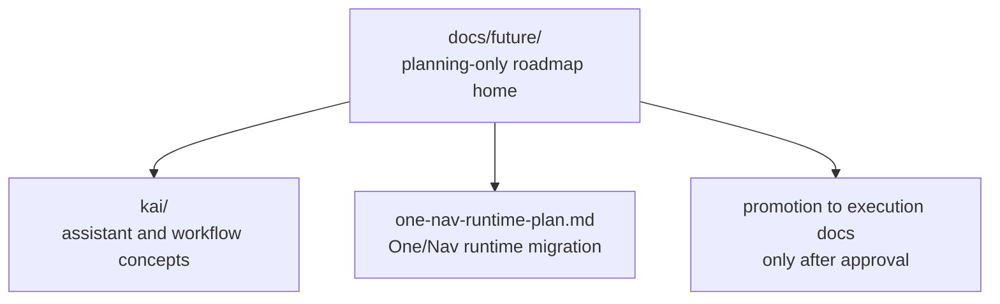

# Hussh Future Roadmap

> Planning-only home for future-state concepts, R&D assessment, and promotion criteria.

## Visual Map

## Purpose

Use `docs/future/` for:

- future-state architecture concepts
- R&D risk assessments
- architecture options and dependency maps
- promotion criteria before execution starts

Do not use this home for:

- durable product thesis
- current implementation contracts
- package-local technical references

## Boundary Model

| Layer | Purpose | Home |
| --- | --- | --- |
| Vision | durable north stars and product thesis | `docs/vision/` |
| Future roadmap | planning-only future-state concepts and R&D assessment | `docs/future/` |
| Execution | active implementation contracts and package docs | `docs/reference/`, `consent-protocol/docs/`, `hushh-webapp/docs/` |

## Promotion Rule

A document may move out of `docs/future/` only when:

1. the concept is approved for execution
2. the execution owner is known
3. the implementation surfaces are known
4. the content can be split into execution-owned docs instead of remaining a speculative concept note

Promotion targets:

- cross-cutting execution contracts -> `docs/reference/...`
- backend execution docs -> `consent-protocol/docs/...`
- frontend/product execution docs -> `hushh-webapp/docs/...`

## Current Domains

- [kai/README.md](./kai/README.md): Kai future-state concepts and delegated workflow planning
- [one-nav-runtime-plan.md](./one-nav-runtime-plan.md): planning-only migration path from the current Kai-first runtime to the One/Kai/Nav ontology

## References

- [../vision/README.md](../vision/README.md): durable Hussh north stars
- [../reference/operations/documentation-architecture-map.md](../reference/operations/documentation-architecture-map.md): canonical docs-home map
- [../reference/operations/docs-governance.md](../reference/operations/docs-governance.md): docs placement and promotion rules
