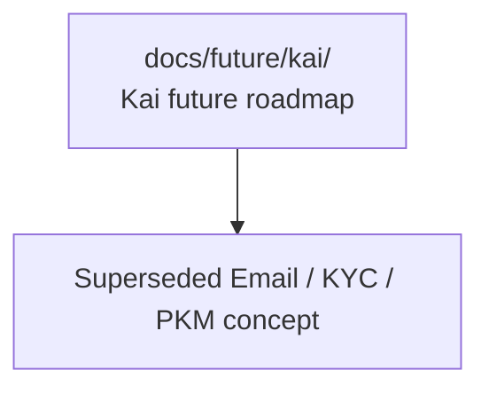

# Kai Future Roadmap

> Planning-only home for Kai future-state architecture, assistant workflows, and R&D risk assessment.

## Visual Map

## Purpose

Use this directory for Kai concepts that are:

- directionally important
- architecture-relevant
- not yet approved execution work

Kai north stars stay in [../../vision/kai/README.md](../../vision/kai/README.md). Execution-owned Kai contracts belong in `docs/reference/`, `consent-protocol/docs/`, or `hushh-webapp/docs/` once approved.

## Current Concepts

- [email-kyc-pkm-assistant.md](./email-kyc-pkm-assistant.md): superseded planning history for email/KYC structured writeback. KYC is now owned by the One-led multi-agent roadmap, not by Kai.

Current One/Kai/Nav/KYC ownership lives in [../one-nav-runtime-plan.md](../one-nav-runtime-plan.md).

## Promotion Rule

When a Kai future concept becomes approved work:

1. keep the original future doc as planning history only if it still adds value
2. split implementation detail into execution-owned docs by subsystem
3. remove any speculative wording from the execution docs
