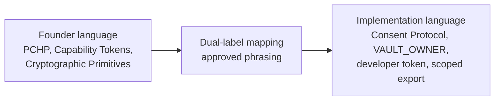

# Founder Language Matrix

Status: canonical terminology contract for founder-language architecture framing and implementation-language mapping across the Hussh platform docs.

## Visual Map



## Purpose

This document keeps the entire docs surface speaking one architecture language.

Use founder terms first when the page is describing platform meaning, trust boundaries, or system intent. Immediately map those terms to the checked-in runtime surfaces when the page needs engineering precision.

This is a documentation contract, not a code rename plan.

## Dual-Label Rule

1. Lead with the founder term when describing architecture.
2. Follow with the implementation label when route, API, package, token, or storage precision matters.
3. Keep current code symbols, endpoint paths, package names, and token names unchanged.
4. Do not present future-state concepts as shipped behavior unless a checked-in runtime surface proves them.

Approved phrasing pattern:

- `PCHP (implemented today through the Consent Protocol developer API + MCP consent/export flow)`
- `Capability Tokens (implemented today as consent tokens, including VAULT_OWNER and scoped tokens)`
- `TrustLink / A2A delegation (current delegated-access implementation surface)`

## Terminology Matrix

| Founder term | Current implementation term(s) | Meaning / boundary | Founder term may lead in | Implementation term must stay primary in | Approved dual-label phrasing |
| --- | --- | --- | --- | --- | --- |
| `PCHP` | Consent request, approval, status, encrypted scoped export, Developer API, MCP | The public approval handshake between an external app and a Hussh user for scoped encrypted access | platform overviews, founder briefs, architecture narratives, developer-lane framing | endpoint docs, setup guides, request/response contracts, package README examples | `PCHP (implemented today through the Consent Protocol developer API + MCP consent/export flow)` |
| `Capability Tokens` | `VAULT_OWNER`, consent token, scoped token, developer token | Tokens that prove granted authority and bound what data or operation is allowed | trust model sections, IAM overviews, founder-facing prose | API tables, auth headers, code snippets, runtime validation docs | `Capability Tokens (implemented today as consent tokens, including VAULT_OWNER and scoped tokens)` |
| `Cryptographic Primitives` | BYOK, wrapped export key, key derivation, ciphertext, vault wrappers, X25519-AES256-GCM | The cryptographic material and local key control that keep Hussh ciphertext-only at rest | security sections, platform architecture, mobile and vault framing | algorithm names, key fields, env vars, plugin APIs, protocol examples | `Cryptographic Primitives (implemented today through BYOK, vault wrappers, wrapped export keys, and local key derivation)` |
| `Separation of Duties` | frontend/backend trust boundary, web proxy vs native plugin split, route/service ownership, future Kai/Nav direction | The division between user-held secrets, app execution, backend policy, and future stronger policy lanes | architecture maps, mobile docs, founder briefs, control-plane framing | file ownership docs, package-local implementation notes, route/runtime ownership tables | `Separation of Duties (implemented today through the frontend/backend trust boundary and the web-proxy/native-plugin split)` |
| `Tamper-Evident History` | consent audit, export revision, verification artifacts, append-only event tables | The reviewable record of consent and export activity | governance docs, trust sections, founder narratives | exact storage tables, audit payload fields, verification commands | `Tamper-Evident History (implemented today through consent audit tables, export revisions, and verification artifacts; Merkle-log style sealing is not yet shipped)` |
| `TrustLink / A2A delegation` | TrustLink, delegated access, relationship share flows, A2A entry points | Delegated authority that inherits scope and never bypasses consent | agent docs, IAM narratives, platform overview docs | plugin APIs, A2A route contracts, delegated access code paths | `TrustLink / A2A delegation (implemented today through delegated access links, relationship grants, and A2A-compatible entry points)` |
| `Consent Protocol` | `consent-protocol`, FastAPI consent routes, token validation middleware, consent scope catalog | The current backend system that realizes Hussh trust, approval, and scoped access behavior | platform docs, repo maps, founder-aware backend docs | backend package docs, code references, route docs, implementation sections | `Consent Protocol (the current backend system that realizes the platform trust model)` |
| `Developer API / MCP` | `/api/v1`, `/mcp/?token=<developer-token>`, `@hushh/mcp` | The public developer-access lane into Hussh | architecture overviews, founder brief sections, external-platform framing | setup guides, host examples, path tables, package commands | `Developer API / MCP (implemented today through /api/v1, the hosted MCP endpoint, and @hushh/mcp)` |

## Scope Notes

Use the founder label as the heading language for:

- repo-level architecture docs
- current-state platform summaries
- founder and board artifacts
- IAM and trust narratives
- mobile and agent architecture overviews

Use the implementation label directly for:

- endpoint and method tables
- environment-variable references
- code examples
- package install/setup guidance
- explicit token, scope, table, and field names

## Non-Goals

This terminology contract does not:

- rename endpoints
- rename packages
- rename tokens or code symbols
- assert a separate Kai/Nav runtime as currently implemented
- assert Merkle-style sealing, threshold signing, or future PCHP mechanics that are not checked into the repo

## Terminology Audit Checklist

Before merging a terminology-heavy docs change, verify:

1. Founder terms appear in the canonical repo-level docs that define architecture meaning.
2. Implementation labels remain present anywhere a reader must copy a path, token name, package name, or field name exactly.
3. `PCHP` is always mapped back to the current Consent Protocol developer API + MCP consent/export flow.
4. `Capability Tokens` never replace literal runtime labels such as `VAULT_OWNER`, `developer token`, or `consent_token` inside examples.
5. `Tamper-Evident History` never overclaims Merkle-style or hardware-backed sealing.
6. `TrustLink` and `A2A delegation` are described as inherited-scope delegation, not scope escalation.

Suggested sweep:

```bash
rg -n "PCHP|Capability Tokens|Cryptographic Primitives|Separation of Duties|Tamper-Evident History|TrustLink|A2A delegation|developer token|consent token|VAULT_OWNER|scoped export|Consent Protocol" docs consent-protocol/docs hushh-webapp/docs packages/hushh-mcp -S
```

## Related References

- [README.md](./README.md)
- [architecture.md](./architecture.md)
- [api-contracts.md](./api-contracts.md)
- [../iam/architecture.md](../iam/architecture.md)
- [../operations/docs-governance.md](../operations/docs-governance.md)
