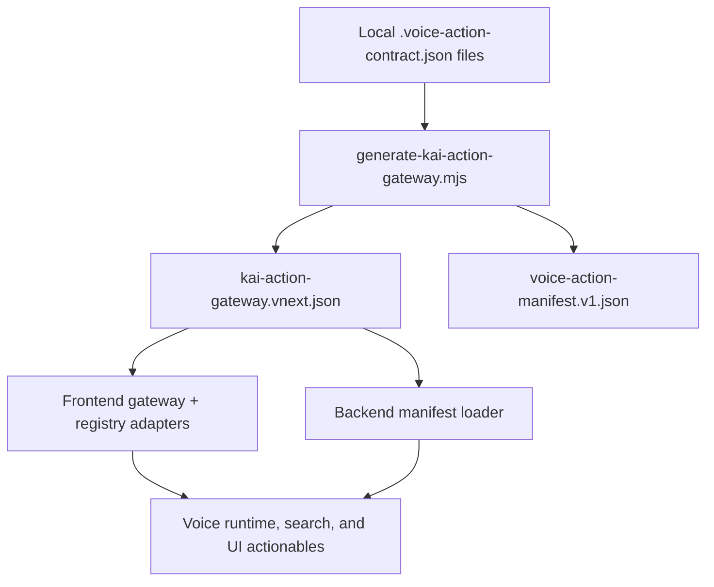

# Kai Action Gateway vNext

Status: canonical capability-authoring reference for Kai voice, typed search, UI actionables, and planner grounding.

## Visual Map



## Purpose

Kai now uses one generated action plane instead of hand-maintained voice maps spread across multiple files.

This document defines:

- how a Kai capability becomes discoverable
- where contributors author the capability contract
- how voice, search, UI actionables, analytics, and docs share the same action identity
- how persona, workspace, vault, consent, and onboarding constraints are enforced centrally
- how authored multi-step workflows are executed safely
- how One, Kai, and Nav speaker ownership is declared without changing execution authority

## Founder Language Mapping

- the generated action plane is part of the platform's `Separation of Duties`: discoverability is authored locally, shared semantically, and enforced at runtime
- `Capability Tokens` and route guards remain the authority checks; action metadata does not create permission
- `TrustLink / A2A delegation` should consume stable `action_id` semantics when agent handoffs are introduced, but no separate delegation plane is implied by this doc

## Architecture

The action system is split into four deliberate layers.

### 1. Local authored contracts

Each voice-capable or search-capable Kai surface owns a colocated `.voice-action-contract.json` file next to the feature surface.

Current generated coverage includes 19 source contracts and 73 actions. Source contracts:

- [page.voice-action-contract.json](../../../hushh-webapp/app/kai/analysis/page.voice-action-contract.json)
- [page-client.voice-action-contract.json](../../../hushh-webapp/app/marketplace/ria/page-client.voice-action-contract.json)
- [page.voice-action-contract.json](../../../hushh-webapp/app/profile/page.voice-action-contract.json)
- [page-client.voice-action-contract.json](../../../hushh-webapp/app/profile/pkm-agent-lab/page-client.voice-action-contract.json)
- [page.voice-action-contract.json](../../../hushh-webapp/app/profile/receipts/page.voice-action-contract.json)
- [page.voice-action-contract.json](../../../hushh-webapp/app/ria/clients/page.voice-action-contract.json)
- [page.voice-action-contract.json](../../../hushh-webapp/app/ria/onboarding/page.voice-action-contract.json)
- [page.voice-action-contract.json](../../../hushh-webapp/app/ria/page.voice-action-contract.json)
- [page.voice-action-contract.json](../../../hushh-webapp/app/ria/picks/page.voice-action-contract.json)
- [page.voice-action-contract.json](../../../hushh-webapp/app/ria/requests/page.voice-action-contract.json)
- [page.voice-action-contract.json](../../../hushh-webapp/app/ria/settings/page.voice-action-contract.json)
- [page.voice-action-contract.json](../../../hushh-webapp/app/ria/workspace/page.voice-action-contract.json)
- [consent-center-page.voice-action-contract.json](../../../hushh-webapp/components/consent/consent-center-page.voice-action-contract.json)
- [kai-command-bar-global.voice-action-contract.json](../../../hushh-webapp/components/kai/kai-command-bar-global.voice-action-contract.json)
- [dashboard-master-view.voice-action-contract.json](../../../hushh-webapp/components/kai/views/dashboard-master-view.voice-action-contract.json)
- [kai-market-preview-view.voice-action-contract.json](../../../hushh-webapp/components/kai/views/kai-market-preview-view.voice-action-contract.json)
- [ria-client-account-detail.voice-action-contract.json](../../../hushh-webapp/components/ria/ria-client-account-detail.voice-action-contract.json)
- [ria-client-request-detail.voice-action-contract.json](../../../hushh-webapp/components/ria/ria-client-request-detail.voice-action-contract.json)
- [ria-client-workspace.voice-action-contract.json](../../../hushh-webapp/components/ria/ria-client-workspace.voice-action-contract.json)

These contracts are the authoring source of truth for capability existence.

### 2. Generated shared gateway

The generator in [generate-kai-action-gateway.mjs](../../../hushh-webapp/scripts/voice/generate-kai-action-gateway.mjs) scans all local contracts and emits:

- [kai-action-gateway.vnext.json](../../../contracts/kai/kai-action-gateway.vnext.json)
- [voice-action-manifest.v1.json](../../../contracts/kai/voice-action-manifest.v1.json)

The gateway is the shared semantic authority.
The manifest is a generated compatibility artifact for consumers that still read the neutral manifest shape.

### 3. Runtime adapter layer

Frontend and backend consume the generated gateway through thin adapters:

- [kai-action-gateway.ts](../../../hushh-webapp/lib/voice/kai-action-gateway.ts)
- [investor-kai-action-registry.ts](../../../hushh-webapp/lib/voice/investor-kai-action-registry.ts)
- [voice_action_manifest.py](../../../consent-protocol/hushh_mcp/services/voice_action_manifest.py)

The registry is no longer a hand-authored source of truth. It is a richer frontend adapter over the generated gateway.

### 4. Runtime metadata

Surface metadata still matters, but only for current state:

- active control
- selected entity
- visible modules
- busy operations
- explainable screen context

Runtime metadata must not invent capabilities. Capability existence comes from local contracts and the generated gateway.

## Universal Action Identity

Every actionable uses one stable `action_id` across:

- voice planning
- typed search
- tappable UI actionables
- command execution
- analytics correlation
- docs and review references

Do not create parallel ids for voice versus search versus tap.

## Authored Contract Shape

Each local contract can define one surface plus its actions.

Required action fields:

- `action_id`
- `speaker_persona`
- `surface_id`
- `label`
- `aliases`
- `meaning`
- `reachability`
- `guard_ids`
- `execution_policy`
- `execution_target`
- `control_ids`
- `search_keywords`

Optional but recommended action fields:

- `delegate_agent_id`
- `state_exposure`
- `docs_references`
- `expected_effects`
- `workflow`

## Speaker Persona And Namespace Rules

Each action declares `speaker_persona`:

| Value | Meaning |
| --- | --- |
| `one` | One owns the spoken framing. Use for generic, route, shell, memory, notification, and handoff actions. |
| `kai` | Kai owns the spoken framing. Use for finance, analysis, portfolio, market, and RIA finance actions. |
| `nav` | Nav owns the spoken framing. Use for privacy, consent, vault, deletion, revocation, and scope-review actions. |
| `kyc` | KYC owns the spoken framing. Use only for explicit KYC workflow status, missing-document review, approval-gated drafts, and structured writeback actions. |

Speaker persona is presentation and prompt ownership only. It does not create authorization and must never bypass auth, vault, consent, persona, workspace, or rollout gates.

`delegate_agent_id` is nullable and declares which specialist executes a user-facing action when One frames the handoff. Allowed values are `one`, `kai`, `nav`, and `kyc`.

Action namespace rules:

- `route.*` is the namespace for navigation and route changes.
- `analysis.*` and `kai.*` remain finance/Kai specialist namespaces.
- `nav.*` is reserved for true Nav privacy/consent guardian actions.
- `kyc.*` is reserved for true KYC identity-workflow actions.
- Do not add legacy aliases from old navigation `nav.*` ids. This migration is a straight rename.

## Multi-Step Workflow Model

Kai supports authored multi-step workflows for actions that require prerequisites before the final action can run.

Rule:

- if the UI can validly move from step 1 to step 2, the voice/search action may do the same
- the chain must be authored explicitly
- the runtime must not guess multi-step flows from transcript heuristics

Supported step types:

- `route_switch`
- `persona_switch`
- `tool_call`
- `prompt`

Each step may declare:

- `preconditions`
- `postconditions`
- `settlement_target`
- `failure_behavior`

Execution rules:

- normal prerequisites may auto-chain
- each step must settle before the next step runs
- any failed precondition or failed settlement stops the chain
- Kai explains the blocking reason instead of pretending success

## Persona, Workspace, and Locked Capability Policy

Persona and workspace are hard preconditions, not hint text.

Rules:

- actions unavailable in the active persona are not directly executable
- if the target persona is already earned, Kai may surface the action but must ask before switching persona when the workflow requires it
- if the capability is not unlocked yet, Kai must block and guide
- route visibility does not override persona, vault, auth, consent, or onboarding guards

Example:

- an investor asking for an RIA action may receive a `requires_persona_switch` availability result
- if RIA is not available, the action stays blocked with explicit setup guidance

## RIA Voice Support

RIA voice support now covers the advisor workspace shell, onboarding, client roster, client workspace, account/request detail fallbacks, stock picks, compatibility routes, and marketplace RIA profile surfaces.

Important RIA action groups:

| Action group | Examples | Execution | Guardrails |
| --- | --- | --- | --- |
| RIA route navigation | `route.ria_home`, `route.ria_onboarding`, `route.ria_clients`, `route.ria_picks`, `route.ria_requests_compat`, `route.ria_settings_compat` | Wired route navigation | `auth_signed_in`, `ria_persona_available`; `route.ria_home` includes confirmed persona-switch workflow when entering from another persona |
| Picks read-only route state | `ria.picks.open_source_kai`, `ria.picks.open_category_top_picks`, `ria.picks.download_template` | Wired route/static download navigation | RIA persona and auth required |
| Client workspace tabs | `route.ria_client_workspace`, `ria.client_workspace.open_access_tab`, `ria.client_workspace.open_portfolio_tab`, `ria.client_workspace.open_explorer_tab` | Wired dynamic route navigation using the current `[userId]` from the active RIA client route | Auth, RIA persona, onboarding, and client relationship guards |
| RIA state-changing actions | `ria.picks.save_package`, `ria.client_workspace.request_access`, `ria.client_workspace.disconnect_relationship`, `marketplace.ria.request_advisory` | Manual-only or confirmation-required and currently unwired | Vault, consent, selected entity, manual execution, or explicit confirmation guards |

`route.ria_home` remains the workspace-entry workflow. It is authored in [page.voice-action-contract.json](../../../hushh-webapp/app/ria/page.voice-action-contract.json), generated into both [kai-action-gateway.vnext.json](../../../contracts/kai/kai-action-gateway.vnext.json) and [voice-action-manifest.v1.json](../../../contracts/kai/voice-action-manifest.v1.json), and projected through the frontend registry.

Execution behavior:

- if the user is already in the RIA persona, the workflow can route to `/ria`
- if the user has RIA available but is currently in another persona, Kai must ask before switching
- if RIA is locked or unavailable, the action blocks with setup guidance
- safe RIA navigation can execute directly
- dynamic client workspace tab routes execute only when the current URL provides the required client id
- RIA mutations remain manual-only or confirmation-required; Kai must not claim it completed them

Verification commands for this surface:

```bash
cd hushh-webapp && npm run verify:voice-gateway
cd hushh-webapp && npm run test -- __tests__/voice/kai-action-gateway.test.ts __tests__/voice/voice-action-manifest.test.ts __tests__/voice/investor-kai-action-registry.test.ts __tests__/voice/voice-grounding.test.ts __tests__/voice/voice-response-executor.test.ts
```

## Search, Voice, and UI Parity

The Kai search bar now resolves actions from the same gateway used by voice grounding.

That means the same action contract controls:

- visible search suggestions
- voice-resolvable aliases
- control-id to action mapping
- workflow availability
- execution policy
- settlement expectations

Contributors should wire UI controls with stable `control_ids` so both screen context and action suggestions resolve through the same action id.

## Durable Memory Policy

Kai voice memory follows the Cryptographic Primitives north star:

- short-term turn memory stays in-memory only
- durable voice memory is accessible only when the vault is unlocked
- durable voice memory is stored only in encrypted client-side form
- durable voice memory must not fall back to plaintext browser storage

Current implementation:

- [voice-memory-store.ts](../../../hushh-webapp/lib/voice/voice-memory-store.ts)
- encrypted IndexedDB
- `localStorage` is not used for durable voice memory

Allowed durable summaries are limited to stable preference-like information.
Secrets, identifiers, documents, statements, tokens, and vault material are rejected.

## Contributor Workflow

When adding a new Kai capability that should be discoverable:

1. Add or update the local `.voice-action-contract.json` next to the surface.
2. Reuse or mint one stable `action_id`.
3. Add `control_ids` for the UI affordances that should map back to the action.
4. Add persona, vault, auth, consent, and route guards up front.
5. Add a `workflow` only when the UI actually supports the prerequisite chain.
6. Run the generator.
7. Run the gateway verifier.
8. Update targeted tests when capability semantics change.

If a feature ships without a local contract:

- it is not voice-discoverable
- it is not typed-search discoverable
- it should be surfaced in review as missing actionability coverage

## Governance

This starts as non-blocking governance, not a hard CI gate.

Local author command:

```bash
cd hushh-webapp && npm run build:voice-gateway
cd hushh-webapp && npm run verify:voice-gateway
```

Review expectations:

- `voice_systems_architect` checks contract and runtime drift
- `reviewer` flags missing local contracts and stale action ids
- `security_consent_auditor` checks persona, consent, vault, and memory policy regressions

Repo-local skill:

- [kai-voice-governance](../../../.codex/skills/kai-voice-governance/SKILL.md)

## Minimum Verification

```bash
cd hushh-webapp && npm run build:voice-gateway
cd hushh-webapp && npm run verify:voice-gateway
cd hushh-webapp && npm run typecheck
cd hushh-webapp && npm run test -- __tests__/voice/kai-action-gateway.test.ts __tests__/voice/voice-action-manifest.test.ts __tests__/voice/investor-kai-action-registry.test.ts __tests__/voice/voice-grounding.test.ts __tests__/voice/voice-turn-orchestrator.test.ts
cd consent-protocol && python3 -m pytest tests/test_kai_voice_contract.py -q
./bin/hushh docs verify
```

## Related References

- [kai-voice-runtime-architecture.md](./kai-voice-runtime-architecture.md)
- [kai-voice-assistant-architecture.md](./kai-voice-assistant-architecture.md)
