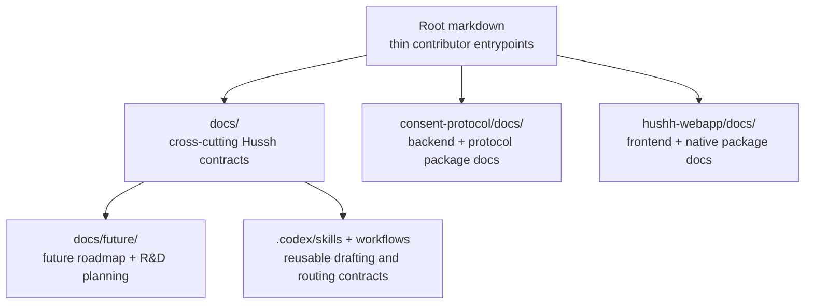

# Documentation Architecture Map

## Visual Map

Use this as the canonical map for documentation placement and consolidation.

Terminology policy: cross-cutting docs may use founder language as the architecture headline vocabulary, but they must preserve implementation labels anywhere a reader needs exact runtime, API, package, or token names. The canonical mapping lives in [../architecture/founder-language-matrix.md](../architecture/founder-language-matrix.md).

Brand policy: public docs, skills, and workflows use `Hussh`; exact runtime identifiers stay literal under [brand-and-compatibility-contract.md](./brand-and-compatibility-contract.md).

## Final Homes

### 1. Root markdowns

Keep these thin:

- `README.md`
- `getting_started.md`
- `contributing.md`
- `TESTING.md`
- policy docs such as `SECURITY.md` and `code_of_conduct.md`

They orient contributors. They do not own the full operational or architectural source of truth.

### 2. `docs/`

This is the canonical home for:

- guides
- architecture
- operations
- quality
- vision
- future roadmap and R&D planning

Anything cross-cutting belongs here.

Within root `docs/`, keep these boundaries explicit:

- `docs/vision/` = durable north stars and product thesis
- `docs/future/` = planning-only future-state concepts, R&D assessments, and promotion criteria
- `docs/reference/` = execution-owned cross-cutting contracts

### 3. `consent-protocol/docs/`

This is the canonical home for:

- backend implementation references
- protocol concepts
- MCP/developer API/backend contributor docs

It must remain understandable as a standalone protocol/backend surface.

### 4. `hushh-webapp/docs/`

This is the canonical home for:

- frontend/native package-local references
- plugin contracts
- implementation notes that do not belong in root `docs/`

### 5. `.codex/skills/` and `.codex/workflows/`

This is the canonical home for:

- reusable drafting rules
- docs and architecture workflow playbooks
- agent-facing route decisions for recurring documentation work

Keep product prose in these files aligned with the same public `Hussh` brand contract as the docs tree.

## Consolidation Rules

Classify every maintained doc as one of:

- `canonical`
- `pointer/index`
- `merge into canonical doc`
- `delete`

Use these rules:

1. Delete stale or redundant docs once the canonical replacement exists.
2. Merge duplicated setup/testing/reference material into one canonical location.
3. Keep root docs thin and link downward.
4. Keep package-specific docs package-local.
5. Update all inbound links in the same change.

## Tier A Diagram Rule

These docs must expose `## Visual Map` or `## Visual Context`:

- canonical indexes
- architecture/map owner docs
- package docs entrypoints
- root docs indexes where they define contributor navigation
- canonical architecture and domain indexes under `docs/reference/`
- skill or workflow references only when they are intended to be human-read onboarding surfaces

## Shared-Artifact Rule

1. Founder or shareable artifacts use GitHub `blob/main` links for canonical references.
2. Local filesystem paths and `file://` links do not belong in shareable artifacts.
3. Diagram symmetry and text overflow are blocking quality issues for shared HTML/PDF outputs.

One-off maintenance notes do not need diagrams.
